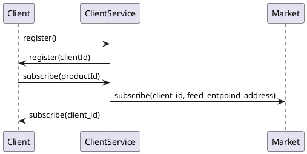

## Client related information
CientService uses REQUEST/RESPONSE pattern. Currently endpoint is set to 127.0.0.1:10090

##### Client registration
Client needs to get clientId to be able to subscribe and receive OrderBook and Trade messages


#### Client registration messages

##### Client registration request:

Request:
 ```json
 {"type": "client_id_request"}
 ```

 Response:
 ```
{
    "type": "client_id_request", 
    "client_id": "3ef1f28d-af48-4a04-be65-3f067071d31b"
}
 ```

##### Client subscribe
Request:
```json
{
    "type": "subscribe_request",
    "client_id": "3ef1f28d-af48-4a04-be65-3f067071d31b",
    "product_id": "ETH-USD"
}
```
Response:
```json
{
    "type": "subscribe_request",
    "client_id": "3ef1f28d-af48-4a04-be65-3f067071d31b",
    "product_id": "ETH_USD",
    "product_endpoint": "tcp://127.0.0.1:8800" }
}
```

##### Client unsubscribe
Request:
```json
{
    "type": "unsubscribe_request",
    "client_id": "3ef1f28d-af48-4a04-be65-3f067071d31b",
    "product_id": "ETH-USD"
}
```
Response:
```json
{
    "type": "unsubscribe_request",
    "client_id": "3ef1f28d-af48-4a04-be65-3f067071d31b",
    "product_id": "ETH_USD",
    "product_endpoint": "tcp://127.0.0.1:8800" }
}
```

##### Other messages

Server can send also heartbeat message if there is longer period when no message will be transmitted. Client should response with the same message or any other to ensure server that there is a connection.

TODO:
- Make endpoint address (with port) configurable