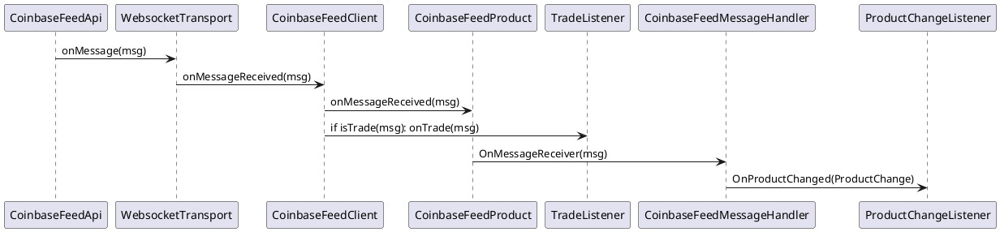
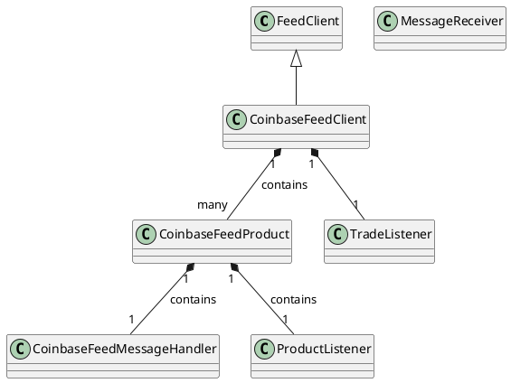
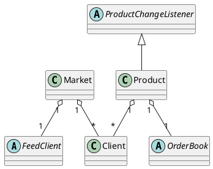
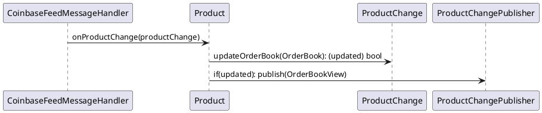
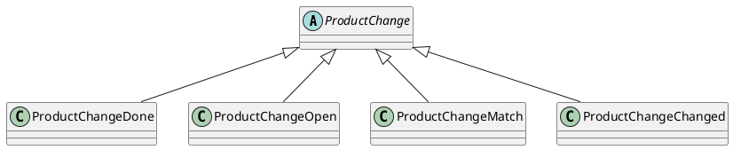
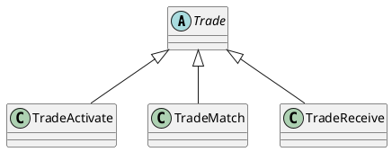

## QS Server design

### Transport side

##### Coinbase FeedClient sequence diagram
WebsocketTransport feed message reception by MessageReceiver interface. It shows example of implementation for Coinbase

* WebsocketTransport is responsible for Websocket layer and communication between Coinbase/other websocket api with the rest of the qs server
* CoinbaseFeedClient implements MessageReceiver interface and provides initial logic related to the Coinbase api - mainly message dispatching
* CoinbaseFeedProduct implements logic responsib le for ensuring that messages comes in the right order by ensuring that all sequence numbers are consecutive
* CoinbaseFeedMessageHandler creates ProductChanges from messages. It binds generic qs-server business logic with Coinbase specific.

##### FeedClient class diagram
CoinbaseFeedClient implements FeedClient interface and contains all 
CoinbaseFeedProducts. On message reception it calls onMessageReceived() only on CoinbaseFeedProduct which listens for received productId.

CoinbaseFeedProduct listens only for one productId and implements logic specific to coinbase api - requesting all orderbook entries at the beggining, queuing messages and ensuring the order of messages by checking sequence number.

CoinbaseFeedMessageHandler receives coinbase message for specific productId and creates ProductChange from it. Then it notifies Product though ProductChangeListener interface.

Any market api which provides feed messaging might implement FeedClient interface in a similar way and use some part of the existing implementation if possible.

##### Top level Market class diagram
Simple top level class diagram which shows compositions of the main domain parts

##### Sequence diagram after creating ProductChange:
Classes wchich implements ProductChange interface encapsulates logic related to specifig changes. New ProductChange might be added and FeedClient interface implementation can create it. In Coinbase use case CoinbaseFeedMessageHandler class creates concrete ProductChange's

##### ProductData subclasses

##### ProductData subclasses
