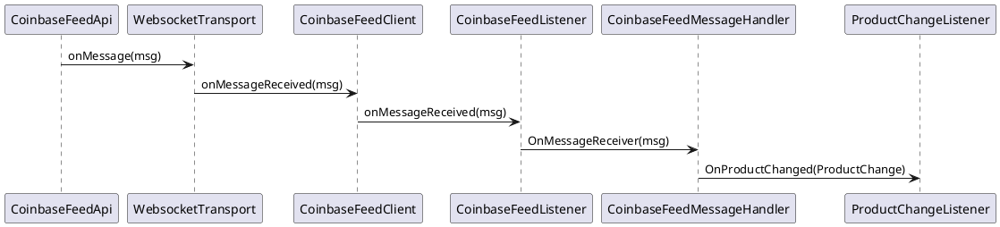
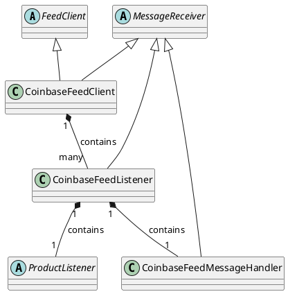
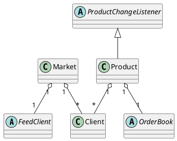
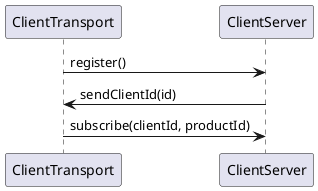
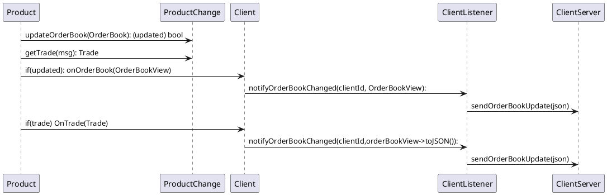
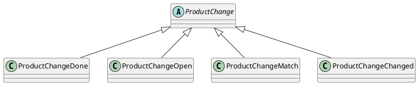

## QOS Server design

### Transport side

##### FeedClient sequence diagram
WebsocketTransport signals message reception by MessageReceiver interface


##### FeedClient class diagram
CoinbaseFeedClient, CoinbaseFeedListener and CoinbaseMessageHandler implements some kind of decorator pattern by implementing MessageReceiver interface.

CoinbaseFeedClient implements FeedClient interface and contains all 
CoinbaseFeedListeners. On message reception it calls onMessageReceived() only on CoinbaseFeedListener which listens for received productId.

CoinbaseFeedListener listens only for one productId and implements logic specific to coinbase api - requesting all orderbook entries at the beggining, queuing messages and ensuring the order of messages by checking sequence number.

CoinbaseFeedMessageHandler receives coinbase message for specific productId and creates ProductChange from it. Then it notifies Product though ProductChangeListener interface.

Any market api which provides feed messaging might implement FeedClient interface in a similar way and use some part of the existing implementation if possible.




##### Top level Market class diagram
Simple top level class diagram which shows compositions of the main domain parts


##### Client registration
Client needs to get clientId to be able to subscribe and receive Orderbook and Trade messages


##### Sequence diagram after creating ProductChange:
Classes wchich implements ProductChange interface encapsulates logic related to specifig changes. New ProductChange might be added and FeedClient interface implementation can create it. In Coinbase use case CoinbaseFeedMessageHandler class creates concrete ProductChange's



##### ProductData subclasses


##### ClientServer ouptut data
Client server can provide the following data:
OrderBook message with currently avaialable capacity and price
```json
{
"bid":{
        {
            "price": 34.4,
            "size": 40.5
        },
        {
            "price": 33.4,
            "size": 40.5
        },
        ...
},
"ask":{
        {
            "price": 31.4,
            "size": 45.5
        },
        {
            "price": 30.4,
            "size": 23.5
        },
        ...
}
}
```

Trade messages
```json
{
    "type":"match"
    "product_id":"ETH-USD"
    "order_id":"d50ec984-77a8-460a-b958-66f114b0de9b"
}
```
```json
{
    "type":"done"
    "product_id":"ETH-USD"
    "order_id":"d50ec984-77a8-460a-b958-66f114b0de9b"
}
```
```json
{
    "type":"open"
    "product_id":"ETH-USD"
    "order_id":"d50ec984-77a8-460a-b958-66f114b0de9b"
    "remaining_size": 30.5
}
```
```json
{
    "type":"change"
    "product_id":"ETH-USD"
    "order_id":"d50ec984-77a8-460a-b958-66f114b0de9b"
    "remaining_size": 30.5
}
```